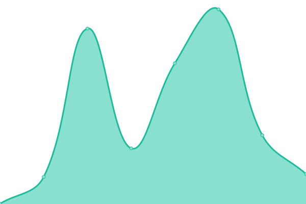
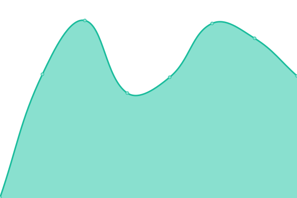
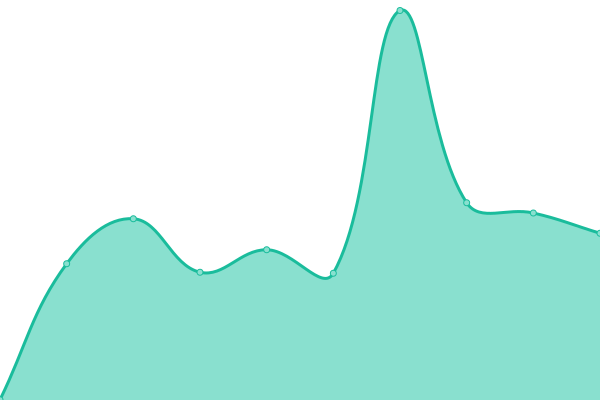

# [📈 Live Status](https://status.kuzzle.io): <!--live status--> **🟩 All systems operational**

[](https://github.com/kuzzleio/status-page/actions?query=workflow%3A%22Uptime+CI%22)
[](https://github.com/kuzzleio/status-page/actions?query=workflow%3A%22Response+Time+CI%22)
[](https://github.com/kuzzleio/status-page/actions?query=workflow%3A%22Graphs+CI%22)
[](https://github.com/kuzzleio/status-page/actions?query=workflow%3A%22Static+Site+CI%22)
[](https://github.com/kuzzleio/status-page/actions?query=workflow%3A%22Summary+CI%22)

This hosts the monitor and status page for Kuzzle, powered by [Upptime](https://github.com/upptime/upptime).

<!--start: status pages-->
<!-- This summary is generated by Upptime (https://github.com/upptime/upptime) -->
<!-- Do not edit this manually, your changes will be overwritten -->
<!-- prettier-ignore -->
| URL | Status | History | Response Time | Uptime |
| --- | ------ | ------- | ------------- | ------ |
|  [Kuzzle Website](https://kuzzle.io) | 🟩 Up | [kuzzle-website.yml](https://github.com/kuzzleio/status-page/commits/HEAD/history/kuzzle-website.yml) | <details><summary> 1072ms</summary><br><a href="https://status.kuzzle.io/history/kuzzle-website"></a><br><a href="https://status.kuzzle.io/history/kuzzle-website"></a><br><a href="https://status.kuzzle.io/history/kuzzle-website"></a><br><a href="https://status.kuzzle.io/history/kuzzle-website"></a><br><a href="https://status.kuzzle.io/history/kuzzle-website"></a></details> | <details><summary><a href="https://status.kuzzle.io/history/kuzzle-website">100.00%</a></summary><a href="https://status.kuzzle.io/history/kuzzle-website"></a><br><a href="https://status.kuzzle.io/history/kuzzle-website"></a><br><a href="https://status.kuzzle.io/history/kuzzle-website"></a><br><a href="https://status.kuzzle.io/history/kuzzle-website"></a><br><a href="https://status.kuzzle.io/history/kuzzle-website"></a></details>
|  [Kuzzle Blog](https://blog.kuzzle.io) | 🟩 Up | [kuzzle-blog.yml](https://github.com/kuzzleio/status-page/commits/HEAD/history/kuzzle-blog.yml) | <details><summary> 356ms</summary><br><a href="https://status.kuzzle.io/history/kuzzle-blog"></a><br><a href="https://status.kuzzle.io/history/kuzzle-blog"></a><br><a href="https://status.kuzzle.io/history/kuzzle-blog"></a><br><a href="https://status.kuzzle.io/history/kuzzle-blog"></a><br><a href="https://status.kuzzle.io/history/kuzzle-blog"></a></details> | <details><summary><a href="https://status.kuzzle.io/history/kuzzle-blog">100.00%</a></summary><a href="https://status.kuzzle.io/history/kuzzle-blog"></a><br><a href="https://status.kuzzle.io/history/kuzzle-blog"></a><br><a href="https://status.kuzzle.io/history/kuzzle-blog"></a><br><a href="https://status.kuzzle.io/history/kuzzle-blog"></a><br><a href="https://status.kuzzle.io/history/kuzzle-blog"></a></details>
|  [Kuzzle Docs](https://docs.kuzzle.io) | 🟩 Up | [kuzzle-docs.yml](https://github.com/kuzzleio/status-page/commits/HEAD/history/kuzzle-docs.yml) | <details><summary> 241ms</summary><br><a href="https://status.kuzzle.io/history/kuzzle-docs"></a><br><a href="https://status.kuzzle.io/history/kuzzle-docs"></a><br><a href="https://status.kuzzle.io/history/kuzzle-docs"></a><br><a href="https://status.kuzzle.io/history/kuzzle-docs"></a><br><a href="https://status.kuzzle.io/history/kuzzle-docs"></a></details> | <details><summary><a href="https://status.kuzzle.io/history/kuzzle-docs">100.00%</a></summary><a href="https://status.kuzzle.io/history/kuzzle-docs"></a><br><a href="https://status.kuzzle.io/history/kuzzle-docs"></a><br><a href="https://status.kuzzle.io/history/kuzzle-docs"></a><br><a href="https://status.kuzzle.io/history/kuzzle-docs"></a><br><a href="https://status.kuzzle.io/history/kuzzle-docs"></a></details>
|  [Discord #1](https://discord-redirect.app.kuzzle.io) | 🟩 Up | [discord-1.yml](https://github.com/kuzzleio/status-page/commits/HEAD/history/discord-1.yml) | <details><summary> 518ms</summary><br><a href="https://status.kuzzle.io/history/discord-1"></a><br><a href="https://status.kuzzle.io/history/discord-1"></a><br><a href="https://status.kuzzle.io/history/discord-1"></a><br><a href="https://status.kuzzle.io/history/discord-1"></a><br><a href="https://status.kuzzle.io/history/discord-1"></a></details> | <details><summary><a href="https://status.kuzzle.io/history/discord-1">100.00%</a></summary><a href="https://status.kuzzle.io/history/discord-1"></a><br><a href="https://status.kuzzle.io/history/discord-1"></a><br><a href="https://status.kuzzle.io/history/discord-1"></a><br><a href="https://status.kuzzle.io/history/discord-1"></a><br><a href="https://status.kuzzle.io/history/discord-1"></a></details>
|  [Discord #2](https://join.discord.kuzzle.io) | 🟩 Up | [discord-2.yml](https://github.com/kuzzleio/status-page/commits/HEAD/history/discord-2.yml) | <details><summary> 544ms</summary><br><a href="https://status.kuzzle.io/history/discord-2"></a><br><a href="https://status.kuzzle.io/history/discord-2"></a><br><a href="https://status.kuzzle.io/history/discord-2"></a><br><a href="https://status.kuzzle.io/history/discord-2"></a><br><a href="https://status.kuzzle.io/history/discord-2"></a></details> | <details><summary><a href="https://status.kuzzle.io/history/discord-2">100.00%</a></summary><a href="https://status.kuzzle.io/history/discord-2"></a><br><a href="https://status.kuzzle.io/history/discord-2"></a><br><a href="https://status.kuzzle.io/history/discord-2"></a><br><a href="https://status.kuzzle.io/history/discord-2"></a><br><a href="https://status.kuzzle.io/history/discord-2"></a></details>
|  PaaS Console (API) | 🟩 Up | [paa-s-console-api.yml](https://github.com/kuzzleio/status-page/commits/HEAD/history/paa-s-console-api.yml) | <details><summary> 754ms</summary><br><a href="https://status.kuzzle.io/history/paa-s-console-api"></a><br><a href="https://status.kuzzle.io/history/paa-s-console-api"></a><br><a href="https://status.kuzzle.io/history/paa-s-console-api"></a><br><a href="https://status.kuzzle.io/history/paa-s-console-api"></a><br><a href="https://status.kuzzle.io/history/paa-s-console-api"></a></details> | <details><summary><a href="https://status.kuzzle.io/history/paa-s-console-api">99.91%</a></summary><a href="https://status.kuzzle.io/history/paa-s-console-api"></a><br><a href="https://status.kuzzle.io/history/paa-s-console-api"></a><br><a href="https://status.kuzzle.io/history/paa-s-console-api"></a><br><a href="https://status.kuzzle.io/history/paa-s-console-api"></a><br><a href="https://status.kuzzle.io/history/paa-s-console-api"></a></details>
|  PaaS Console (Web) | 🟩 Up | [paa-s-console-web.yml](https://github.com/kuzzleio/status-page/commits/HEAD/history/paa-s-console-web.yml) | <details><summary> 725ms</summary><br><a href="https://status.kuzzle.io/history/paa-s-console-web"></a><br><a href="https://status.kuzzle.io/history/paa-s-console-web"></a><br><a href="https://status.kuzzle.io/history/paa-s-console-web"></a><br><a href="https://status.kuzzle.io/history/paa-s-console-web"></a><br><a href="https://status.kuzzle.io/history/paa-s-console-web"></a></details> | <details><summary><a href="https://status.kuzzle.io/history/paa-s-console-web">100.00%</a></summary><a href="https://status.kuzzle.io/history/paa-s-console-web"></a><br><a href="https://status.kuzzle.io/history/paa-s-console-web"></a><br><a href="https://status.kuzzle.io/history/paa-s-console-web"></a><br><a href="https://status.kuzzle.io/history/paa-s-console-web"></a><br><a href="https://status.kuzzle.io/history/paa-s-console-web"></a></details>
|  PaaS Packages | 🟩 Up | [paa-s-packages.yml](https://github.com/kuzzleio/status-page/commits/HEAD/history/paa-s-packages.yml) | <details><summary> 474ms</summary><br><a href="https://status.kuzzle.io/history/paa-s-packages"></a><br><a href="https://status.kuzzle.io/history/paa-s-packages"></a><br><a href="https://status.kuzzle.io/history/paa-s-packages"></a><br><a href="https://status.kuzzle.io/history/paa-s-packages"></a><br><a href="https://status.kuzzle.io/history/paa-s-packages"></a></details> | <details><summary><a href="https://status.kuzzle.io/history/paa-s-packages">99.91%</a></summary><a href="https://status.kuzzle.io/history/paa-s-packages"></a><br><a href="https://status.kuzzle.io/history/paa-s-packages"></a><br><a href="https://status.kuzzle.io/history/paa-s-packages"></a><br><a href="https://status.kuzzle.io/history/paa-s-packages"></a><br><a href="https://status.kuzzle.io/history/paa-s-packages"></a></details>
|  PaaS Container registry | 🟩 Up | [paa-s-container-registry.yml](https://github.com/kuzzleio/status-page/commits/HEAD/history/paa-s-container-registry.yml) | <details><summary> 647ms</summary><br><a href="https://status.kuzzle.io/history/paa-s-container-registry"></a><br><a href="https://status.kuzzle.io/history/paa-s-container-registry"></a><br><a href="https://status.kuzzle.io/history/paa-s-container-registry"></a><br><a href="https://status.kuzzle.io/history/paa-s-container-registry"></a><br><a href="https://status.kuzzle.io/history/paa-s-container-registry"></a></details> | <details><summary><a href="https://status.kuzzle.io/history/paa-s-container-registry">100.00%</a></summary><a href="https://status.kuzzle.io/history/paa-s-container-registry"></a><br><a href="https://status.kuzzle.io/history/paa-s-container-registry"></a><br><a href="https://status.kuzzle.io/history/paa-s-container-registry"></a><br><a href="https://status.kuzzle.io/history/paa-s-container-registry"></a><br><a href="https://status.kuzzle.io/history/paa-s-container-registry"></a></details>
|  PaaS CD | 🟩 Up | [paa-s-cd.yml](https://github.com/kuzzleio/status-page/commits/HEAD/history/paa-s-cd.yml) | <details><summary> 602ms</summary><br><a href="https://status.kuzzle.io/history/paa-s-cd"></a><br><a href="https://status.kuzzle.io/history/paa-s-cd"></a><br><a href="https://status.kuzzle.io/history/paa-s-cd"></a><br><a href="https://status.kuzzle.io/history/paa-s-cd"></a><br><a href="https://status.kuzzle.io/history/paa-s-cd"></a></details> | <details><summary><a href="https://status.kuzzle.io/history/paa-s-cd">100.00%</a></summary><a href="https://status.kuzzle.io/history/paa-s-cd"></a><br><a href="https://status.kuzzle.io/history/paa-s-cd"></a><br><a href="https://status.kuzzle.io/history/paa-s-cd"></a><br><a href="https://status.kuzzle.io/history/paa-s-cd"></a><br><a href="https://status.kuzzle.io/history/paa-s-cd"></a></details>
|  PaaS SSO | 🟩 Up | [paa-s-sso.yml](https://github.com/kuzzleio/status-page/commits/HEAD/history/paa-s-sso.yml) | <details><summary> 1210ms</summary><br><a href="https://status.kuzzle.io/history/paa-s-sso"></a><br><a href="https://status.kuzzle.io/history/paa-s-sso"></a><br><a href="https://status.kuzzle.io/history/paa-s-sso"></a><br><a href="https://status.kuzzle.io/history/paa-s-sso"></a><br><a href="https://status.kuzzle.io/history/paa-s-sso"></a></details> | <details><summary><a href="https://status.kuzzle.io/history/paa-s-sso">99.91%</a></summary><a href="https://status.kuzzle.io/history/paa-s-sso"></a><br><a href="https://status.kuzzle.io/history/paa-s-sso"></a><br><a href="https://status.kuzzle.io/history/paa-s-sso"></a><br><a href="https://status.kuzzle.io/history/paa-s-sso"></a><br><a href="https://status.kuzzle.io/history/paa-s-sso"></a></details>
|  PaaS LNS (Web) | 🟩 Up | [paa-s-lns-web.yml](https://github.com/kuzzleio/status-page/commits/HEAD/history/paa-s-lns-web.yml) | <details><summary> 911ms</summary><br><a href="https://status.kuzzle.io/history/paa-s-lns-web"></a><br><a href="https://status.kuzzle.io/history/paa-s-lns-web"></a><br><a href="https://status.kuzzle.io/history/paa-s-lns-web"></a><br><a href="https://status.kuzzle.io/history/paa-s-lns-web"></a><br><a href="https://status.kuzzle.io/history/paa-s-lns-web"></a></details> | <details><summary><a href="https://status.kuzzle.io/history/paa-s-lns-web">100.00%</a></summary><a href="https://status.kuzzle.io/history/paa-s-lns-web"></a><br><a href="https://status.kuzzle.io/history/paa-s-lns-web"></a><br><a href="https://status.kuzzle.io/history/paa-s-lns-web"></a><br><a href="https://status.kuzzle.io/history/paa-s-lns-web"></a><br><a href="https://status.kuzzle.io/history/paa-s-lns-web"></a></details>
|  PaaS LNS (MQTT) | 🟩 Up | [paa-s-lns-mqtt.yml](https://github.com/kuzzleio/status-page/commits/HEAD/history/paa-s-lns-mqtt.yml) | <details><summary> 124ms</summary><br><a href="https://status.kuzzle.io/history/paa-s-lns-mqtt"></a><br><a href="https://status.kuzzle.io/history/paa-s-lns-mqtt"></a><br><a href="https://status.kuzzle.io/history/paa-s-lns-mqtt"></a><br><a href="https://status.kuzzle.io/history/paa-s-lns-mqtt"></a><br><a href="https://status.kuzzle.io/history/paa-s-lns-mqtt"></a></details> | <details><summary><a href="https://status.kuzzle.io/history/paa-s-lns-mqtt">100.00%</a></summary><a href="https://status.kuzzle.io/history/paa-s-lns-mqtt"></a><br><a href="https://status.kuzzle.io/history/paa-s-lns-mqtt"></a><br><a href="https://status.kuzzle.io/history/paa-s-lns-mqtt"></a><br><a href="https://status.kuzzle.io/history/paa-s-lns-mqtt"></a><br><a href="https://status.kuzzle.io/history/paa-s-lns-mqtt"></a></details>

<!--end: status pages-->

## Infrastructure

The [`hosting/`](./hosting/) directory holds the Terraform files for deploying the status page infrastructure.

### Installation

To work on the infrastructure, you will need to install several tools:

- [just](https://github.com/casey/just) to have access to the pre-defined commands.
- [Kourou](https://github.com/kuzzleio/kourou) to decrypt and encrypt the secret files.
- Terraform, either [directly](https://developer.hashicorp.com/terraform/install?product_intent=terraform) or using [tfenv](https://github.com/tfutils/tfenv).
- The [Scaleway CLI](https://github.com/scaleway/scaleway-cli), then log in to your Scaleway account by [creating an API key for yourself](https://www.scaleway.com/en/docs/identity-and-access-management/iam/how-to/create-api-keys/).  
  **Note**: you'll need to select the "default" project as the project used for Object Storage operations.
- The [GitHub CLI](https://cli.github.com/), then log in to your GitHub account.
- The [AWS CLI](https://aws.amazon.com/cli/), then log in to your AWS account using `aws configure` (the profile that will be used is `default`).

### Preparation

If this is your first time working with the infrastructure, you will need to first initialize the directory:

```sh
just init
kourou vault:decrypt gh_secrets.enc.json --vault-key '<VAULT_PASSWORD>'
```

> [!NOTE]
> The Vault password can be found in the company password manager.

### Applying changes

To preview your changes to the infrastructure:

```sh
just preview
```

To apply them:

```sh
just apply
```

If you changed a GitHub Actions secret, you'll need to re-encrypt the file before committing it:

```sh
kourou vault:encrypt gh_secrets.json --vault-key '<VAULT_PASSWORD>'
```

### Miscellaneous

#### Exporting the keys

If you need to directly use the Terraform CLI, you can export the access and secret keys used to authenticate against the S3 backend:

```sh
eval `just export-keys`
```

## License

- Code: [MIT](./LICENSE) © [Anand Chowdhary](https://anandchowdhary.com), supported by [Pabio](https://pabio.com)
- Data in the `./history` directory: [Open Database License](https://opendatacommons.org/licenses/odbl/1-0/)
